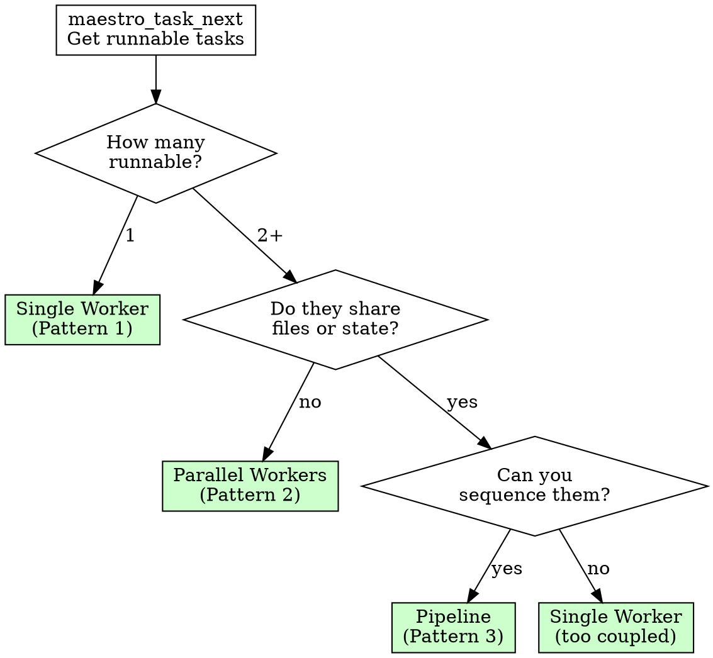

# Dispatching Parallel Agents

## Overview

One agent per independent problem domain. Let them work concurrently.

**Core principle:** If two tasks don't share state, they don't share an agent.

**Violating independence assumptions will produce merge conflicts, wasted work, or silent bugs.**

## When to Use

**Always:**
- 2+ tasks that touch different files/modules
- Multiple test failures with different root causes
- Independent subsystems broken simultaneously

**Never:**
- Failures that might be related (fix one, others might resolve)
- Tasks that edit the same files
- Tasks where output of one feeds input of another
- You don't understand what's broken yet (explore first, dispatch second)

Thinking "they're probably independent"? Verify. Check the files each task will touch. One overlap means they are not independent.

## The Iron Law

```
NO DISPATCH WITHOUT VERIFIED INDEPENDENCE
```

Two tasks touching the same file? Sequential, not parallel.
Unsure if they're independent? Sequential until proven otherwise.

## Prerequisite: Check Runnable Tasks

Before dispatching, use `maestro_task_next` (MCP) or `maestro task-next` (CLI) to get runnable tasks -- tasks whose dependencies are all satisfied and that are in `pending` state.

**Only dispatch tasks that are runnable.** Never claim tasks with unmet dependencies.

Only `done` satisfies dependencies (not `blocked` or `pending`).

**Confirm with the operator first:**
- "These tasks are runnable and independent: [list]. Execute in parallel?"
- Record the decision with `maestro_memory_write`
- Proceed only after operator approval

## Decision Flow



See `reference/delegation-patterns.md` for detailed pattern descriptions.

## Constructing Worker Prompts

Worker prompts are the single most important factor in dispatch success. A vague prompt produces vague results.

### The Five Sections

Every worker prompt needs exactly five sections:

| Section | Purpose | Failure Mode If Missing |
|---------|---------|------------------------|
| **Goal** | One sentence: what does "done" look like? | Worker thrashes, unclear when finished |
| **Scope** | Which files/directories the worker may touch | Worker refactors the world |
| **Context** | Error messages, signatures, design decisions | Worker wastes time exploring what you already know |
| **Constraints** | What the worker must NOT do | Worker makes "improvements" you didn't ask for |
| **Output** | What the worker must report back | You cannot verify the work without re-reading everything |

### What Context to Include

<Good>
```markdown
## Context

Error output:
```
TypeError: Cannot read property 'status' of undefined
  at processTask (src/tasks/processor.ts:47)
```

The `processTask` function receives a `TaskResult` from `executeStep()`.
`executeStep` returns `undefined` when the step is skipped (see src/steps/executor.ts:23).

Design decision: skipped steps should return `{ status: 'skipped' }` not `undefined`.
```
Specific error, location, root cause hypothesis, design intent
</Good>

<Bad>
```markdown
## Context

The task processing is broken. Look at the processor and executor files.
There might be a null issue somewhere.
```
Vague, forces worker to explore everything
</Bad>

### What Context to Omit

- Project history ("we used to have X, then we changed to Y")
- Unrelated architecture ("the auth system works like...")
- Alternative approaches you already rejected
- Motivational text ("this is critical for the release")

**Rule of thumb:** If removing a sentence doesn't change what the worker will do, remove it.

### Context Sizing

| Task Complexity | Context Length | Detail Level |
|----------------|---------------|--------------|
| Fix a known bug with stack trace | 10-20 lines | Error + location + hypothesis |
| Implement from spec | 20-40 lines | API signature + types + example usage + patterns |
| Refactor module | 30-50 lines | Current structure + target structure + constraints |
| Investigate unknown issue | 15-25 lines | Symptoms + what you've ruled out + where to start |

See `reference/agent-prompt-templates.md` for complete templates by task type.

## Dispatch Workflow

### 1. Identify Independent Domains

Group tasks by what they touch:

```
Task A: Fix auth validation     --> src/auth/*, tests/auth/*
Task B: Fix parser edge case    --> src/parser/*, tests/parser/*
Task C: Fix renderer crash      --> src/renderer/*, tests/renderer/*
```

**Verify independence:**
- [ ] No shared files between any pair of tasks
- [ ] No shared type definitions being modified
- [ ] No import dependencies between task outputs
- [ ] Each task's tests can run in isolation
- [ ] Merge order doesn't matter

One "no" means the tasks are NOT independent. Use Pattern 1 or Pattern 3 instead.

### 2. Dispatch

```bash
# Find runnable tasks with compiled specs
maestro_task_next  # MCP -- returns recommended task with spec

# Claim each task before dispatching a worker
maestro_task_claim --task 01-fix-auth       # MCP: maestro_task_claim
maestro_task_claim --task 02-fix-parser
maestro_task_claim --task 03-fix-renderer

# Each claimed task gets a worker agent.
# The pre-agent hook auto-injects the task spec into the worker prompt.
```

### 3. Monitor

While workers are running:
- `maestro_status` to check progress
- Watch for `blocked` status -- a worker needs a decision
- Watch for stale `claimed` tasks -- a worker may have crashed (claim expired)

### 4. Review Before Merging

**MANDATORY. Never auto-merge.**

For each completed worker:

```bash
# Read the worker's report
maestro task-report-read --task 01-fix-auth
```

**Review checklist:**
- [ ] Worker stayed within declared scope (didn't edit files outside scope)
- [ ] Changes match the goal (didn't "improve" things you didn't ask for)
- [ ] Tests pass in the worker's worktree
- [ ] Summary explains what changed and why
- [ ] No obvious errors in the approach

### 5. Mark Done and Merge Incrementally

Mark each task done and merge one at a time. Re-test after each merge.

```bash
# Mark task done with summary
maestro_task_done --task 01-fix-auth --summary "Fixed null check in validator"

# Merge first worker
maestro merge --task 01-fix-auth

# Verify tests still pass after merge
bun test

# Mark and merge second worker
maestro_task_done --task 02-fix-parser --summary "Added edge case handling"
maestro merge --task 02-fix-parser

# Verify again
bun test
```

**Why incremental?** If Worker A and Worker C both pass independently but break when combined, incremental merging isolates the conflict to the second merge.

## Handling Worker Issues

### Worker Reports a Blocker

The worker encountered something it cannot resolve without a decision.

```bash
# The worker calls maestro_task_block with a reason.
# The task moves to `blocked` state.

# 1. Check status to see blocked tasks
maestro_status

# 2. Read the blocker details
maestro task-report-read --task 01-fix-auth

# 3. Present to operator, get decision
# "Worker blocked: 'Auth module uses two different session formats.
#  Should I normalize to format A or format B?'"

# 4. Unblock with the decision
maestro_task_unblock --task 01-fix-auth --decision "Normalize to format A -- it's the newer format"
```

**Do NOT guess the answer.** Present to the operator. Wait.

### Worker Crashes or Stalls (Stale Claim)

The worker's claim has expired -- no active worker is running the task.

**Detection:** `maestro_status` shows the task as `claimed` with an expired timestamp.

**Recovery:**
```bash
# maestro_task_next auto-resets expired claims to pending.
# Simply call task_next to find runnable tasks -- the stale task will be reset.
maestro_task_next

# Now claim it fresh for a new worker
maestro_task_claim --task 01-fix-auth
```

**Diagnosis before retrying:**
1. Read any partial report the worker left
2. Identify: was the spec unclear? Was the task too broad? Did the environment break?
3. Choose recovery strategy:

| Root Cause | Recovery |
|-----------|----------|
| Spec was ambiguous | Update spec with `maestro task-spec-write`, then re-claim |
| Task was too broad | Split into subtasks, dispatch separately |
| Worker went out of scope | Add explicit constraints to spec, re-claim |
| External breakage (build, deps) | Fix environment first, then re-claim |

## Common Mistakes

### Over-Specifying the Prompt

<Bad>
```markdown
Open src/auth/validator.ts. Go to line 47. Change the if-condition
from `status === undefined` to `status == null`. Then open the test
file. Add a test case. Use expect().toBe(). Run bun test.
```
Micromanaging. The worker knows how to code.
</Bad>

<Good>
```markdown
## Goal
Fix null-safety bug in auth validator: `processTask` crashes when
`executeStep` returns undefined for skipped steps.

## Scope
src/auth/validator.ts, tests/auth/validator.test.ts

## Context
[error message, relevant function signature, design decision]

## Constraints
Do not change the executeStep API.

## Output
Root cause, fix applied, test added, all tests green.
```
States the problem, trusts the worker to solve it.
</Good>

### Under-Specifying Context

<Bad>
```markdown
Fix the auth bug.
```
Which auth bug? In which file? What does the error look like?
</Bad>

<Good>
```markdown
Fix: `processTask` in `src/auth/validator.ts:47` throws
`TypeError: Cannot read property 'status' of undefined`
when `executeStep` returns `undefined` for skipped steps.
```
Specific file, line, error, cause.
</Good>

### Not Reviewing Worker Output

Dispatching is not "fire and forget." Workers make systematic errors:
- Fixing symptoms instead of root causes
- Adding retries/timeouts instead of fixing the bug
- Modifying files outside their scope
- "Improving" code you didn't ask them to change

**Always review before merge. Always run tests after merge.**

### Dispatching Coupled Tasks in Parallel

```
Task A: Add new field to UserType    --> src/types/user.ts
Task B: Use new UserType field       --> src/auth/validator.ts
```

These look independent (different files), but Task B imports from Task A's output. Dispatching in parallel means Task B works with the OLD UserType and fails.

**Test:** If you reverse the merge order, do both still work? If not, they are coupled.

### Ignoring the Merge Order

Even for truly independent tasks, merge one at a time and test between merges. "Independent" is your assessment -- the code is the truth.

### Dispatching Before Understanding

```
"I have 5 failing tests. Let me dispatch 5 agents."
```

First: are the failures related? Run the tests, read the errors. If 4 of the 5 share a root cause, dispatching 5 agents wastes 4 agents.

**Rule:** Investigate enough to identify independent domains. Then dispatch.

## Verification Checklist

Before marking dispatch complete:

- [ ] All workers finished (none stuck or stale)
- [ ] Read every worker's summary report
- [ ] Verified each worker stayed within scope
- [ ] Merged one at a time with tests between each merge
- [ ] Full test suite passes after all merges
- [ ] No unintended side effects (spot-check changed files)
- [ ] Recorded decisions and outcomes with `maestro_memory_write`

Cannot check all boxes? You are not done.

## Real Example

**Scenario:** 6 test failures across 3 files after major refactoring.

**Step 1 -- Investigate:**
```
agent-tool-abort.test.ts:         3 failures (timing errors)
batch-completion-behavior.test.ts: 2 failures (tools not executing)
tool-approval-race-conditions.test.ts: 1 failure (execution count = 0)
```

**Step 2 -- Verify independence:**
- Abort logic, batch completion, and race conditions are separate subsystems
- Each test file tests different code paths
- No shared files between fixes
- [ok] Independent

**Step 3 -- Dispatch:**
```
# Use maestro_task_next to find runnable tasks
# Claim each: maestro_task_claim
Worker 1 --> agent-tool-abort.test.ts (timing issues)
Worker 2 --> batch-completion-behavior.test.ts (event structure)
Worker 3 --> tool-approval-race-conditions.test.ts (async waiting)
```

**Step 4 -- Results:**
- Worker 1: Replaced arbitrary timeouts with event-based waiting
- Worker 2: Fixed event structure bug (threadId in wrong place)
- Worker 3: Added wait for async tool execution to complete

**Step 5 -- Integration:**
- `maestro_task_done` for Worker 1, merged, ran tests: green
- `maestro_task_done` for Worker 2, merged, ran tests: green
- `maestro_task_done` for Worker 3, merged, ran tests: green
- Full suite: green. Zero conflicts.

**Time saved:** 3 problems solved in the time of 1.

## When Stuck

| Problem | Solution |
|---------|----------|
| Workers keep editing same files | Tasks are coupled. Use Pattern 1 or Pattern 3. |
| Worker blocks on a question | Read blocker via `maestro_status`, present to operator, unblock with `maestro_task_unblock`. |
| Worker produces wrong output | Review spec -- was it clear? Update with `maestro task-spec-write` and retry. |
| Merge conflicts after parallel work | Independence was misjudged. Resolve conflict, then re-verify remaining merges. |
| Not sure if tasks are independent | They are not. Start sequential, parallelize after first task proves isolation. |
| Too many tasks to dispatch at once | Batch into groups of 3-4. Merge one batch before starting the next. |
| Stale claim -- worker disappeared | `maestro_task_next` auto-resets expired claims. Re-claim and dispatch a new worker. |

## Final Rules

```
Parallel dispatch --> verified independent --> operator approved
Otherwise         --> sequential
```

```
Worker done --> review report --> maestro_task_done --> run tests --> merge
Otherwise   --> not done
```

No exceptions without operator approval.
